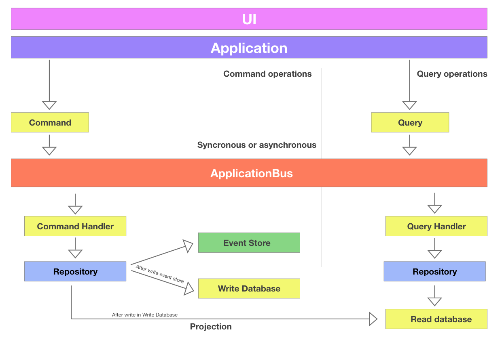

# BoilerPlate Microservice  API

**Built with:**
- Docker
- PHP 7.4
- Mezzio
- Laminas
- Eloquent ORM
- Phinx (migrations)
- Swagger-PHP
- Mysql 8

AND

- CQRS Techniques


## Getting Started


If you are going to develop in an ongoing project see:


Or to start a project from scratch:

Clone this project

Define environment variables in /config/.env file. See a example in config/sample.env

Start your dev environment with docker-compose

```bash
$ cd docker/dev
$ docker-compose up -d
```

This one build container sample (php, port 80) 

After attach/exec sample container and execute composer:

LINUX

```bash
$ sudo docker exec -it sample /bin/bash
```

Windows

```bash
$ winpty docker exec -it sample bash
```

And in container

```bash
$ composer install
$ composer run --timeout=0 serve 
(or )
$ composer serve
```

After build dev schema in your development database, using Phinx commands

```bash
$ vendor/bin/phinx migrate
```

```bash
$ vendor/bin/phinx seed:run
```
Use api key autentication to acces endpoits, for example:
Common User access

```bash
X-API-CLIENT : user_logged
X-API-KEY :kouX3CH9PQiqoDZOJOjI44JgP5ws4Qtf3L0UdxUQe24qv
X-USER-TOKEN  : {A valid Token AgenciaVirtual}
```
Privileged service api client

```bash
X-API-CLIENT : client_test
X-API-KEY :Vd1BvuKn9lTlvAjZTAV2wT6bSbj3ZlUIpJ9I3JV0SEbb3
X-APP-ID    : APP1 (service client)
```
**Now use POSTMAN or similar tool**

- Api client credential client_test

`Acces example endpoint to client api ` *http://localhost/api/v1/condid/1576/profile/syndic/userid/38187

- Api client credential user_logged + valid user token of [http://agenciabeta.guarida.com.br](http://agenciabeta.guarida.com.br)

`Acces example endpoint to client api` *http://localhost/api/v2/sample/get/condid/1576/profile/syndic/userid/38187*

## Tasks defined in composer

- `composer install` - Install all dependencies of the project
- `composer update` - Update/install dependencies of the project
- `composer check` - Run the task that to validate PSR-2 and tests
- `composer cs-check` - Validate the PSR-2 code indent
- `composer fix` - Fix code indent to the PSR-2
- `composer serve` - Run built-in server
- `composer test` - Run tests
- `composer test-coverage` - Run the code coverage report, generate html in *build/reports/coverage/index.html*
- `composer generate-swagger` - Generate api documention based on OpenAPI with Swagger-PHP in [http://localhost/swagger/](http://localhost/swagger/)


# About CQRS package
## Workflow application

